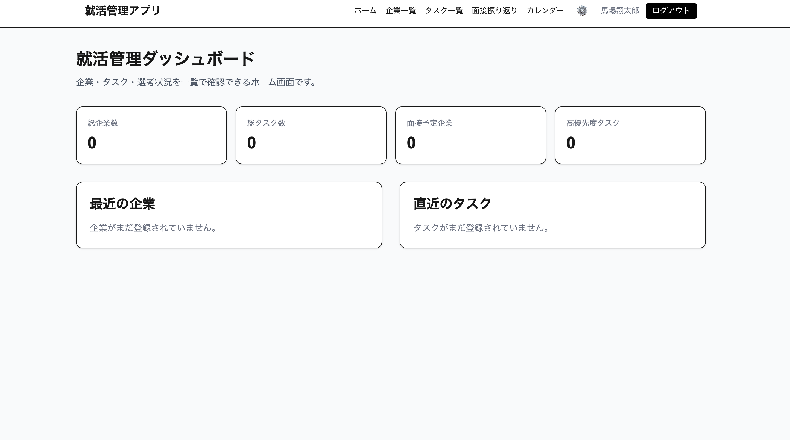
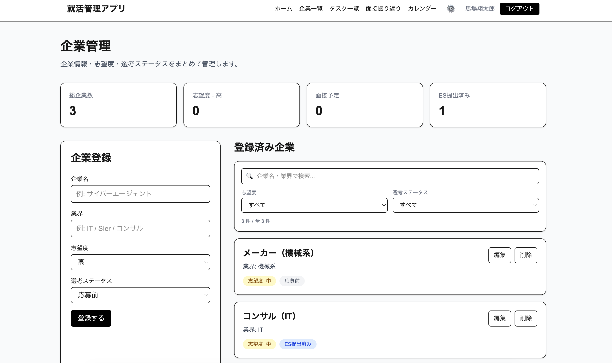
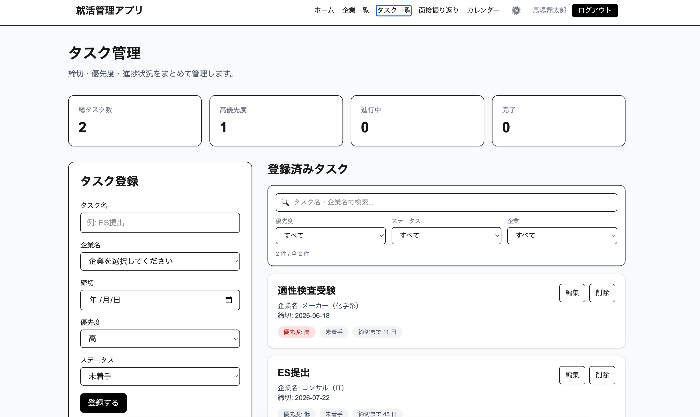
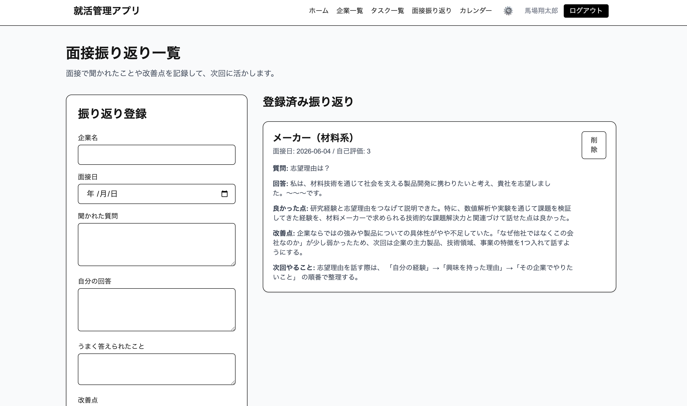

# 就活管理アプリ（Job Manager）

就職活動の情報を一元管理し、企業・タスク・面接・カレンダーを効率よく管理するWebアプリ

[](https://nextjs.org/)
[](https://www.typescriptlang.org/)
[](https://tailwindcss.com/)
[](https://www.prisma.io/)
[](https://supabase.com/)
[](https://job-manager-eight.vercel.app)

**デモ：[https://job-manager-eight.vercel.app](https://job-manager-eight.vercel.app)**

---

## 背景・開発動機

就職活動では、応募企業の情報・ESの締切・面接の日程・振り返りメモなど、膨大な情報を同時に管理する必要があります。しかし実際には、これらの情報がスプレッドシート・メモアプリ・カレンダーなど各所に分散し、管理が煩雑になる課題がありました。

**情報の分散を解消し、就活に集中できる環境を作ること**を目的として開発しました。

---

## 対象ユーザー

- 複数の企業に応募中で、情報管理に困っている就活生
- ESの締切や面接日程を一元管理したい方
- 面接の振り返りを記録・蓄積して次回に活かしたい方

---

## 主な機能

### 認証
- NextAuth.js（Auth.js v5）によるGoogleアカウントログイン
- ユーザーごとにデータを分離管理

### 企業管理
- 企業の登録・編集・削除
- 志望度の管理（高・中・低）
- 選考ステータスの管理（応募前 / ES提出済み / Webテスト済み / 面接予定 / 内定 / お祈り）
- 企業名・業界のテキスト検索
- 志望度・ステータスによるフィルタリング

### タスク管理
- タスクの登録・編集・削除（ES締切・面接準備など）
- 優先度・ステータスの管理
- 締切順での自動ソート
- 締切超過・直近タスクの視覚的ハイライト
- タスク名・企業名のテキスト検索
- 優先度・ステータス・企業によるフィルタリング

### カレンダー機能
- タスクの締切・面接日程をカレンダービューで一覧表示
- 優先度に応じた色分け表示（高：赤 / 中：黄 / 低：グレー）
- カレンダー上の日付クリックでタスクの新規追加
- イベントクリックで詳細・編集・削除が可能なモーダル表示

### 面接振り返り
- 面接で聞かれた質問・自分の回答を記録
- 良かった点・改善点・次回やることの記録
- 自己評価（1〜5段階）

### 締切通知（メール）
- 締切まで3日以内の未完了タスクを毎日23時にメール通知
- Vercel Cron Jobs + Resend によって自動実行
- 通知はユーザーごとに個別配信

### ダッシュボード
- 総企業数・総タスク数・面接予定件数・高優先度タスク数をサマリー表示
- 最近登録した企業の一覧
- 直近の締切タスク一覧

### 表示設定
- 文字サイズの変更（小・中・大）
- テーマカラーの変更（黒・青・緑・ローズ）
- フォントの変更（ゴシック・明朝・等幅）
- 設定はLocalStorageに保存され、再訪時も維持

---

## 技術スタック

| カテゴリ | 技術 |
|------|------|
| フレームワーク | Next.js 15（App Router） |
| 言語 | TypeScript |
| スタイリング | Tailwind CSS |
| 認証 | NextAuth.js beta（Auth.js v5）/ Google OAuth |
| ORM | Prisma 5 |
| データベース | PostgreSQL（Supabase） |
| カレンダー | react-big-calendar / date-fns |
| メール通知 | Resend |
| バッチ処理 | Vercel Cron Jobs |
| デプロイ | Vercel |

---

## ディレクトリ構成

```
job-manager/
├── app/
│   ├── api/
│   │   ├── auth/[...nextauth]/
│   │   │   └── route.ts            # NextAuth ハンドラー
│   │   ├── companies/route.ts      # 企業 CRUD API
│   │   ├── tasks/route.ts          # タスク CRUD API
│   │   ├── reviews/route.ts        # 振り返り CRUD API
│   │   └── cron/notify/route.ts    # 締切通知バッチ（Vercel Cron）
│   ├── calendar/
│   │   └── page.tsx                # カレンダー画面
│   ├── companies/
│   │   └── page.tsx                # 企業管理画面
│   ├── tasks/
│   │   └── page.tsx                # タスク管理画面
│   ├── reviews/
│   │   └── page.tsx                # 面接振り返り画面
│   ├── login/
│   │   └── page.tsx                # ログイン画面
│   ├── components/
│   │   ├── Header.tsx
│   │   ├── CompanyCard.tsx
│   │   ├── CompanyForm.tsx
│   │   ├── CompanySummary.tsx
│   │   ├── DashboardSummary.tsx
│   │   ├── RecentCompanies.tsx
│   │   ├── SettingsPanel.tsx       # 表示設定UI
│   │   ├── SettingsWrapper.tsx
│   │   ├── TaskCard.tsx
│   │   ├── TaskForm.tsx
│   │   ├── TaskSummary.tsx
│   │   └── UrgentTasks.tsx
│   ├── contexts/
│   │   └── SettingsContext.tsx     # 表示設定の状態管理
│   ├── layout.tsx
│   └── page.tsx                    # ダッシュボード
├── prisma/
│   └── schema.prisma               # DBスキーマ定義
├── lib/
│   └── prisma.ts                   # Prismaクライアント
├── types/
│   ├── company.ts
│   ├── task.ts
│   └── review.ts
├── auth.ts                         # NextAuth設定
├── vercel.json                     # Vercel Cron設定
└── proxy.ts                        # 認証ミドルウェア
```

---

## 設計・工夫した点

### コンポーネント設計
UIを再利用可能な単位でコンポーネント化しました。`CompanyCard` `TaskCard` などを分離することで、各画面のロジックとUIの関心を分離し、保守性を高めています。

### TypeScriptによる型安全な実装
`Company` `Task` `Review` の型を `types/` に集約し、コンポーネント間のデータの受け渡しを型安全に管理しています。

### useMemoによるパフォーマンス最適化
検索・フィルタリング処理を `useMemo` でメモ化し、不要な再計算を防いでいます。企業・タスクが増えても描画パフォーマンスが低下しにくい設計です。

### 認証設計
NextAuth.js beta（Auth.js v5）を採用し、Googleアカウントによるログインを実装しました。サインイン時にPrismaでユーザーをupsertし、セッションにはDBのユーザーIDを紐付けることで、ユーザーごとのデータ管理を実現しています。

### 締切通知の自動化
Vercel Cron Jobs を使い、毎日23時に全ユーザーの締切タスクをチェックして自動メール配信しています。メール送信には Resend を採用し、`CRON_SECRET` によるリクエスト認証でセキュリティも確保しています。

### 表示設定の永続化
`SettingsContext` で文字サイズ・テーマカラー・フォントを一元管理し、`localStorage` に保存することで再訪時も設定が維持される仕組みにしています。

### UX面の配慮
- 締切が3日以内のタスクは黄色ボーダー、超過済みは赤ボーダーで強調
- フィルター中は「○件 / 全△件」で絞り込み状態を可視化
- フィルターをワンクリックでリセットできるボタンを用意
- スマホ・タブレットにも対応したレスポンシブデザイン

---

## スクリーンショット

### ダッシュボード


### 企業管理


### タスク管理


### 面接振り返り


---

## ローカル環境での起動方法

```bash
# リポジトリをクローン
git clone https://github.com/Baba-1811/job-manager.git
cd job-manager

# 依存関係をインストール
npm install
```

### 環境変数の設定

`.env` ファイルをルートに作成し、以下を設定してください：

```env
AUTH_SECRET=your_auth_secret
AUTH_GOOGLE_ID=your_google_client_id
AUTH_GOOGLE_SECRET=your_google_client_secret
AUTH_URL=http://localhost:3000

DATABASE_URL=your_supabase_database_url
DIRECT_URL=your_supabase_direct_url

RESEND_API_KEY=your_resend_api_key
CRON_SECRET=your_cron_secret
```

> Google OAuthのクライアントIDとシークレットは [Google Cloud Console](https://console.cloud.google.com/) で取得してください。
> ローカル用のリダイレクトURIとして `http://localhost:3000/api/auth/callback/google` を登録する必要があります。

> `RESEND_API_KEY` は [Resend](https://resend.com/) でアカウントを作成して取得してください。

### DBのマイグレーション

```bash
npx prisma migrate dev
```

### 開発サーバーの起動

```bash
npm run dev
```

ブラウザで [http://localhost:3000](http://localhost:3000) を開いてください。

---

## 今後追加予定の機能

| 機能 | 概要 | ステータス |
|------|------|------|
| 認証機能 | NextAuth.jsによるGoogleログイン対応、ユーザーごとのデータ管理 | ✅ 実装済み |
| DB化（Prisma + PostgreSQL） | LocalStorageからDBへ移行し、データの永続化・複数端末対応を実現 | ✅ 実装済み |
| カレンダー機能 | タスク締切・面接日程をカレンダービューで可視化、追加・編集・削除対応 | ✅ 実装済み |
| 締切通知メール | Vercel Cron + Resend で締切3日前にメール自動通知 | ✅ 実装済み |
| スマホ対応（レスポンシブ） | モバイルでも快適に使えるUI改善 | ✅ 実装済み |
| 表示設定 | 文字サイズ・テーマカラー・フォントをカスタマイズ | ✅ 実装済み |
| Googleカレンダー連携 | Google Calendar APIを使って面接日程を自動同期 | 計画中 |
| 企業情報自動補完 | 会社名入力で業界・規模などを自動取得（外部API連携） | 計画中 |
| 検索・フィルター強化 | 複合条件検索、並び替え機能の拡充 | 計画中 |

---

## 作者

**Baba Shotaro**

- GitHub: [@Baba-1811](https://github.com/Baba-1811)
- Demo: [https://job-manager-eight.vercel.app](https://job-manager-eight.vercel.app)

---

## ライセンス

MIT License
